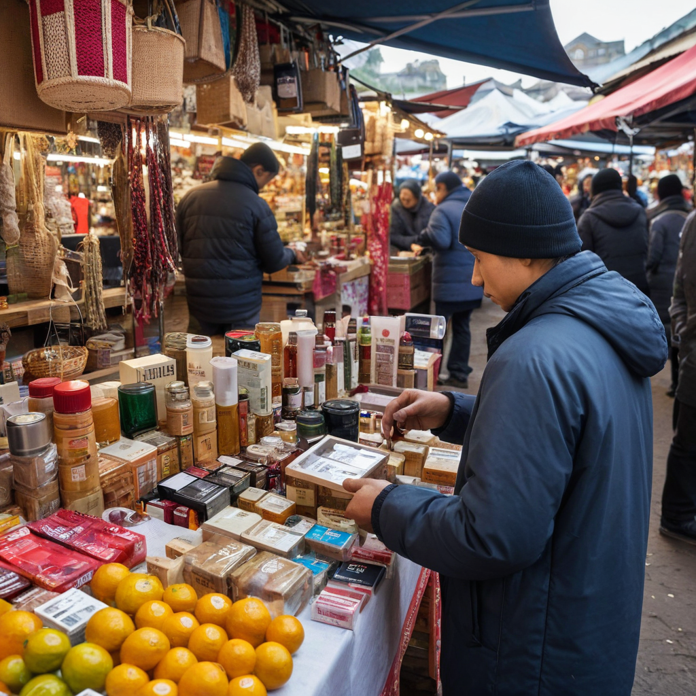

# Lab 1
The examples in this folder require that you download models to your computer. The image generation examples use a specific folder structure for different models. This folder is ignored in the .gitignore file because of the large size of the models. The structure is the following:

data/DiffusionModels  
data/FashionMNIST  
data/LoRAs  

## LLM Discussion
In the file llm_discussion.py two LLMs are made to discuss an inital question put by a user.

### Example run of program

```
***This application lets you start a discussion between two AI-LLMs, alternating between their answers-***

Please state your discussion question: Is Donald Trump a bad person?
Which model should go first?
1. Llama 3.2
2. Deepseek R1
-->: 1
```

[llama3.2]: Opinions about Donald Trump's character and actions vary widely depending on one's perspective, values, and experiences. It's challenging to make a definitive judgment about someone's moral character, as it's often subjective and influenced by individual biases and contexts.

That being said, there are many criticisms of Donald Trump's behavior, policies, and statements that have been raised by various groups, media outlets, and experts. Some of these concerns include:

1. **Ethics and accountability**: Critics argue that Trump has shown a pattern of self-dealing, lack of transparency, and disregard for traditional norms of governance.
2. **Racial and social injustice**: Trump's comments and policies have been criticized for exacerbating racial tensions, perpetuating stereotypes, and targeting marginalized communities.
3. **Truthfulness and fact-checking**: Trump has been accused of spreading misinformation, denying scientific facts, and attacking the media, which can erode trust in institutions and hinder informed decision-making.
4. **Environmental policies**: His administration's actions on climate change, deregulation, and environmental protection have been criticized by many experts and advocacy groups.
5. **Treatment of women and minorities**: Trump has faced numerous allegations of sexism, misogyny, and racism, which have sparked concerns about his character and leadership style.

On the other hand, some people may argue that Trump's actions and policies have benefited certain groups or individuals, such as:

1. **Economic growth**: His economic policies and tax cuts have led to increased economic growth and job creation in some sectors.
2. **Nationalism and border security**: Trump's stance on immigration, trade, and national sovereignty has resonated with some voters who feel that his approach addresses pressing concerns about borders and security.
3. **Judicial appointments**: His appointment of conservative judges and federal officials has been seen as a significant achievement by some Republicans.

Ultimately, whether or not Donald Trump is considered a "bad person" depends on one's perspective, values, and priorities. It's essential to engage in respectful and nuanced discussions about his actions and policies, considering multiple viewpoints and fact-based information.

What specific aspects of Trump's behavior or policies would you like to discuss?

[deepseek-r1]: Okay, I understand the answer provided. It presented a very balanced and nuanced perspective, acknowledging the subjectivity involved in judging someone's character and listing both criticisms and counterpoints to the question of Trump's nature or impact.

It effectively avoided a direct, simplistic yes/no answer, which is probably the right approach given the complexity and the highly polarized nature of the topic.

The response focused on specific criticisms (ethics, racism, truthfulness, environment, treatment of women/minorities) and specific counterpoints (economic growth, nationalism, judicial appointments), providing concrete areas for discussion rather than just abstract moral debates.

The sharp follow-up question is: **"If the definition of a 'bad person' is subjective, whose criteria do you use to determine if someone meets that standard?"** This directly challenges the premise that a judgment is even possible, forcing the discussion towards the *meaning* of the term itself rather than just debating actions.

```
How many rounds shall we alternate? Choose 5-12: 5
Which model should go next?
1. Llama 3.2
2. Deepseek R1
-->: 1
Change the temperature, i.e. how 'creative' the answers can be? Higher = more creative. Choose 0 - 1.5: 0
```

[llama3.2]: That's a great follow-up question! It highlights the importance of clarifying one's own moral framework and criteria for evaluating someone's character.

To address this, I'd argue that our personal values, cultural background, and life experiences shape our understanding of what constitutes a "bad person." However, acknowledging that these perspectives can be subjective doesn't necessarily mean we should abandon them entirely. Instead, it encourages us to engage in critical self-reflection and consider alternative viewpoints.

For instance, if someone's actions are deemed "bad" by one set of criteria, but not by another, does that imply a lack of moral consistency? Or is it possible that different values or cultural norms lead to differing assessments?

To further complicate the issue, what about cases where individuals exhibit both positive and negative traits simultaneously? How do we reconcile our desire for moral clarity with the complexity of human nature?

Can you think of any examples where a person's actions might be considered "bad" by some but not others, highlighting the subjective nature of moral judgments?

```
Which model should go next?
1. Llama 3.2
2. Deepseek R1
-->: 2
Change the temperature, i.e. how 'creative' the answers can be? Higher = more creative. Choose 0 - 1.5: 0
```

[deepseek-r1]: You've articulated a very nuanced and important point. The subjectivity of moral judgment is indeed a central challenge in ethics. While I agree that our personal frameworks are crucial, I'd like to push back slightly on the idea that *abandoning* them entirely is the goal, as that seems impractical. Instead, perhaps the value lies in **understanding *why*** we hold certain judgments, even within our own frameworks.

Your point about reconciling complexity is well-taken. People aren't binary switches. How do we avoid oversimplifying when evaluating others, especially when our own frameworks might be influenced by biases?

Your examples highlight the core issue beautifully. The question isn't just "Is this person bad?" but "What *reasons* do I have for thinking this person is bad, and how do those reasons align with my own values and experiences?"

This leads me to ask: **What is the actual purpose or function of making a moral judgment like "this person is bad" – is it to arrive at an objective truth, or is it more about understanding the basis of our own perspective and the reasons behind it?**

```
Which model should go next?
1. Llama 3.2
2. Deepseek R1
-->: 1
Change the temperature, i.e. how 'creative' the answers can be? Higher = more creative. Choose 0 - 1.5: 0
```

[llama3.2]: I'm glad you're pushing back on my initial point. You're right that abandoning our personal frameworks entirely might be impractical, if not impossible.

Regarding your question about avoiding oversimplification when evaluating others, I think a crucial step is to acknowledge and actively work to recognize the biases within our own frameworks. This can involve engaging in self-reflection, seeking out diverse perspectives, and being open to revising or refining our judgments as new information becomes available.

However, I'd like to pose a counterpoint: even if we strive to be more nuanced and aware of our biases, don't you think that the very act of making a moral judgment can still be seen as an oversimplification? In other words, isn't it inherently difficult to capture the full complexity of another person's character or actions in a single label like "bad"?

For instance, consider the case of someone who has committed a heinous crime, but also happens to have a loving family and a history of kindness towards those in need. How do we reconcile these seemingly contradictory aspects of their personality? Do we assign them a new moral judgment that takes into account this complexity, or do we stick with our initial label despite the apparent contradiction?

```
Which model should go next?
1. Llama 3.2
2. Deepseek R1
-->: 2
Change the temperature, i.e. how 'creative' the answers can be? Higher = more creative. Choose 0 - 1.5: 0
```

[deepseek-r1]: You've articulated a very compelling point. The inherent complexity of human beings does indeed challenge the utility of simple moral labels. While self-awareness and diverse perspectives are crucial tools for navigating this complexity, you're right to question whether the act of judgment itself might still be a form of reductionism.

My counterpoint would be: while labels can be reductive, the *absence* of judgment or the avoidance of language entirely might itself be a form of oversimplification, potentially leading to a passive acceptance of complexity rather than an active engagement with it.

How do you think we can responsibly acknowledge complexity without relying on labels, and what are the practical implications of striving for judgment-free zones in our moral evaluations?

```
Which model should go next?
1. Llama 3.2
2. Deepseek R1
-->: 1
Change the temperature, i.e. how 'creative' the answers can be? Higher = more creative. Choose 0 - 1.5: 0
```

[llama3.2]: I appreciate your nuanced counterpoint. You're right that avoiding language or judgment altogether might lead to a form of intellectual paralysis, where individuals fail to engage with complex issues.

To responsibly acknowledge complexity without relying on labels, I think it's essential to adopt a more fluid and context-dependent approach to moral evaluation. This could involve embracing a "pragmatic ethics" that prioritizes nuanced understanding over simplistic categorization. By acknowledging the provisional nature of our judgments and being willing to revise them in light of new information or perspectives, we can cultivate a more adaptive and responsive approach to complex issues.

However, I'd like to pose a counterpoint: if we strive for judgment-free zones, don't we risk creating an environment where individuals are shielded from the consequences of their actions? In other words, wouldn't a complete absence of judgment or evaluation lead to a lack of accountability and potentially enable harmful behaviors to persist unchecked?

## Structured Response and Image Generation
In the file generate_prompt_to_image.py a LLM gives a json structured response consisting of an answer, a image prompt and a filename. The image prompt is then used to generate an image using the diffusers library (https://huggingface.co/docs/diffusers/index). Diffusing models can be downloaded at https://huggingface.co/ or https://civitai.com/.

### Example run 1

``` bash
***This application makes an LLM create a prompt which then a diffuser model generates an image from***

Please state your question: Is it possible there exists a world with a green sun?
```
[llama3.2]:

Answer: Yes, it is theoretically possible to have a world with a green sun. However, such a scenario would require significant alterations to our understanding of astrophysics and the conditions necessary for life to exist. In order for a star like our Sun to appear green, it would need to have a very specific composition and energy output. This could potentially occur if the star was primarily composed of elements other than hydrogen and helium, or if its core was able to sustain a unique process that produced a greenish light spectrum. The emergence of such conditions would likely be highly improbable in our observable universe, but it is not impossible to imagine in the vast expanse of theoretical possibilities.

Prompt: A futuristic cityscape at sunset on a planet with a green sun. The sky is painted with hues of lime and mint, casting an ethereal glow over the buildings. The people are dressed in attire that blends seamlessly into the surroundings, as if they were born from the very earth itself. In the distance, towering structures made of a glittering green crystal material pierce the sky, their peaks lost in the swirling vortex of the green sun's light.

Filename: green_sun_cities


### Example run 2
``` bash
***This application makes an LLM create a prompt which then a diffuser model generates an image from***

Please state your question: How can you spot theives in a market?
```
[llama3.2]:

Answer: A good way to spot thieves in a market is not by relying on physical appearance or behavior, but rather by looking at their actions and interactions with others. Here are some key indicators: 1) They don't engage with the vendors, but instead focus on inspecting products closely without buying anything. 2) They don't pay attention to prices, and they don't negotiate. 3) They try to find products that are not on display, or hidden from view. 4) They do not leave a receipt behind when making a purchase. 5) If caught in the act, they will quickly deny all involvement.

Prompt: A person inspecting a product closely without buying anything, while the vendor looks on suspiciously, with a backdrop of market stalls and products. The image should convey a sense of unease and suspicion. Filenames: thieves_at_market

Filename: thieves_at_market




## Structured Response and Image Generation with the addition of LoRA
generate_prompt_to_image_lora.py is the same as the previous example but with a LoRA model that speeds up the image generation.

## Cloud models
You can run large models using Ollamas cloud and API. You will need an Ollama account and create an API key: https://docs.ollama.com/cloud

The file cloud_model.py shows an example on how to print a streaming response or wait until the whole respone is downloaded.
